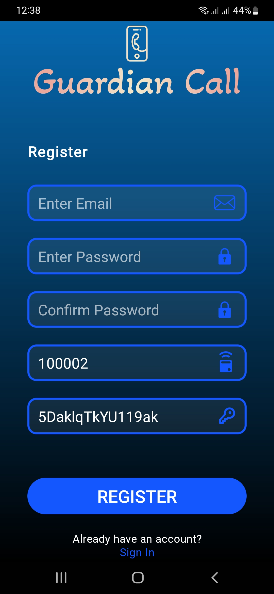

# GuardianCall App

## Introduction 
Guardian call app is the mobile user interface for the GuardianCall electronic pager IoT device. Developed using android studio and java it is used for the caretakers/owners to login, register for the device, receive alert calls from the patients/Button wearers, Set alarms for the IoT device or/and app, receive alrams from the device and manage users.

## Design Overview

  
  

    
    

    
    

    
    

    
    

    
    

