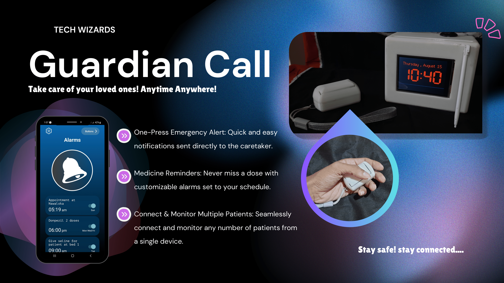
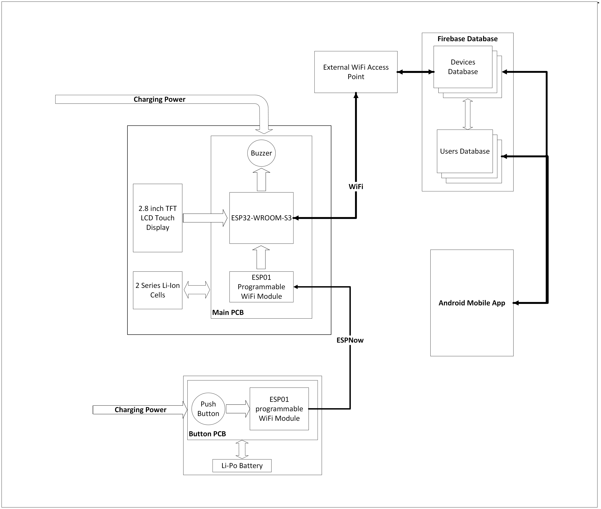
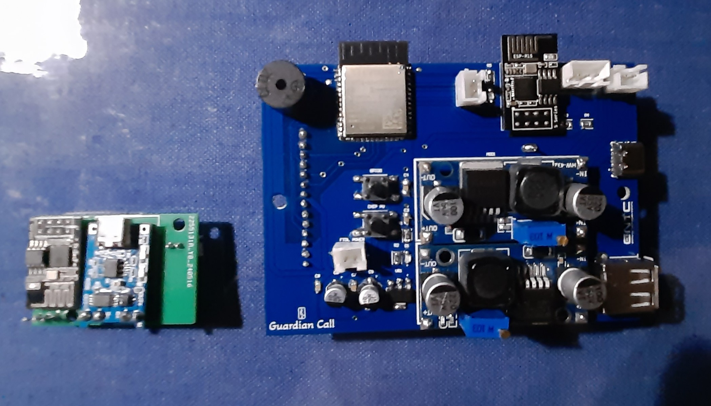
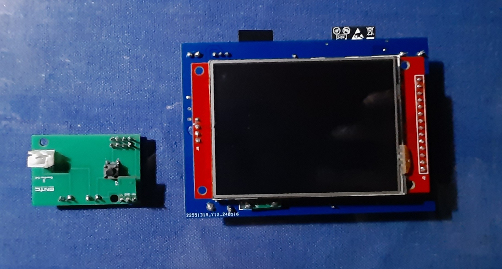
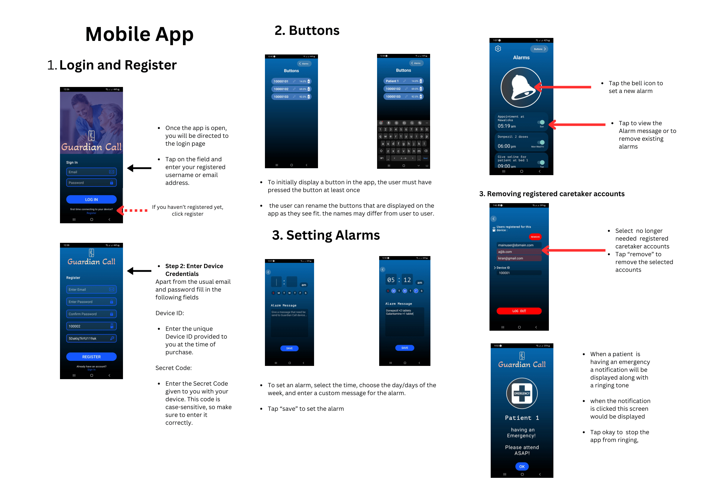

# GuardianCall : Multipurposed elctronic pager IoT device

GuardianCall, is a electronic pager that is developed for the ease of caretakers and bed-ridden inidividuals. This device is intended for both single patient - single caretaker and many patients - many caretakers situations.

## Market pitch

Designed by [Venumi Gihansa Gunasekara](https://github.com/venumigihansa)

## System Block Diagram

There was a major bug in the ESP32 libraries (even remaining unresolved for years in the forums), not operating WiFi and ESP Now at the same time even when the wifi channels are configured. There was no errors or execeptions throwed so we had to try different appoaches.
So after 3 system desgin iterations and considering their pros and cons we implemented our device using the following architecture.

## PCB Design

### Main Unit

### Button

Desgined by [Imansha Manuka Priyanjana](https://github.com/imansha321?tab=followers)

    
    

## Enclosure Design

Designed by [Induwara Illukumbura](https://github.com/induwara-iluk)

## App overview

App was designed scalability and giving best user experience in mind. 

Image credit [Venumi Gihansa Gunasekara](https://github.com/venumigihansa)

For the backend we used firebase and it's BaaS tools and the realtime database was also structured for scalabiluty making overall system architecture cabale of adding any number of new devices, users and any number of buttons for each device (but from the IoT device's firmware it is limite to 100)

.png)

Refer below for the source files and distributions

[Original Girhub Repo for the App](https://github.com/KiranGunathilaka/guardian-call-app)

To securely register a caretaker with a device, following sign-up cards are needed.

## Actual Device

## Some videos in the prototyping phase

[Video 1, before the final circuit implmentation](Assets/VID-20240509-WA0002.mp4)

[Video 2, before using ESP01 for the button, for the proposal evalution](/Assets/VID-20240501-WA0005.mp4)

Furthur updates to the main unit is possible via a USB to TTL converter, so it is possible to make furthur improvements to the hardware after assembling.

For more information, refer to the project report, presentation pdfs above.

